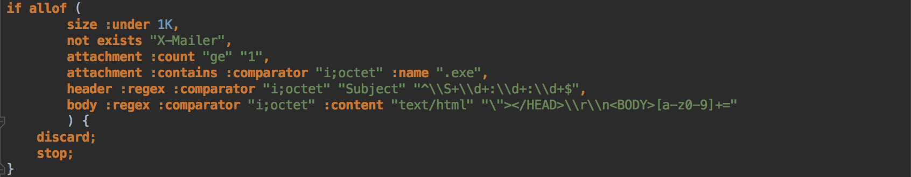

idea-sieve
==========

A language plugin for IntelliJ IDEA that provide basic support for Sieve filtering language.

## Features

* Syntax highlighting
* Grammar checking
* Support for all basic Sieve statements

## How to use

1. Get the plugin 
    - from [releases](https://github.com/qingshan/idea-sieve/releases)
    - Or compile it yourself (see -Building-)
2. Install plugin (Preferences -> Plugins -> Install plugin from disk)
3. Create .siv file (or open examples/*.siv files) and enjoy

## Live Templates

templates/sieve.xml is for IntelliJ IDEA Live Templates, Copy the xml file to the live templates directory (
See note from [Live Templates](https://www.jetbrains.com/idea/webhelp/live-templates.html)):

 * Windows: `<your_user_home_directory>\.IntelliJ IDEA<version_number>\config\templates`
 * Linux: `~IntelliJ IDEA<version>/config/templates`
 * MacOS: `~/Library/Preferences/IntelliJ IDEA<version>/templates`

## Building

1. Clone (or download) this repository
2. Create (or open) Intellij project in this directory with Plugin module
3. Build -> Prepare plugin for deployment -> You will be notified with plugin jar path

## License: MIT
